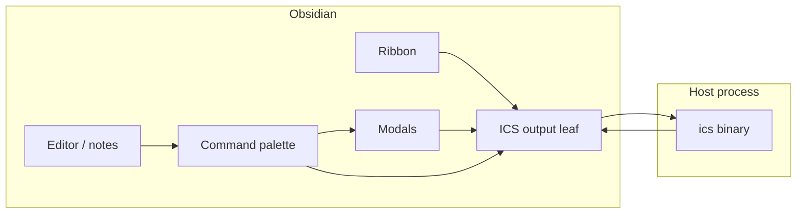

# Obsidian ICS plugin — design

**Date:** 2026-05-05  
**Status:** Approved for planning (brainstorm: architecture §1–§4 locked)  
**Related:** [Feature spec](2026-05-05-obsidian-ics-plugin-spec.md) (phases, non-goals, UX bullets); parent [ics-cli design](2026-05-06-ics-cli-design.md).

---

## 1. Purpose & scope

Ship a **sibling-repo** Obsidian Community Plugin that uses the vault as the editing surface for **`ics`** workflows: local history (B0+), Stratum notes and proposals (B1+), pull and conflicts (B2+), optional vault pull (C). The plugin **invokes** the Rust CLI and **presents** output; it does **not** own `.ics/` storage, SQLite, or Stratum HTTP for parity-critical behavior.

---

## 2. Decisions

| Topic | Choice | Rationale |
|-------|--------|-----------|
| Source location | **Sibling** git repository | Clear release cycle vs `ics-cli`; this repo keeps links and docs until the plugin repo owns README/releases. |
| Integration | **Spawn `ics` only** (no bundled binary, no daemon in v0) | Single source of truth; matches feature spec; revisit bundling only if onboarding data demands it. |
| Secrets | **CLI config only** (`~/.config/ics-cli/credentials.json`, mode `0600`) | Aligns with parent ics-cli design; plugin settings do not store tokens. |

Plugin repository **name** is chosen at sibling-repo bootstrap (e.g. `ics-obsidian`); not blocking design sign-off.

---

## 3. Non-goals (v0)

Same as [feature spec §2](2026-05-05-obsidian-ics-plugin-spec.md): no reimplementation of storage or Stratum client in TypeScript; no federation; no server-side embedding replacement.

---

## 4. Plugin phases vs CLI milestones

| Plugin phase | CLI milestone | Behavior |
|--------------|---------------|----------|
| **P0** | B0 | Settings; spawn `ics` for `status`, `commit`, `log`, `diff`; output in dedicated surface + notices. |
| **P1** | B0 | Optional debounced `status` after save; diff in split or modal. |
| **P2** | B1 | Login, publish, proposal commands; read-only display of `conflict_hints` when CLI surfaces them. |
| **P3** | B2 | Pull / refresh; conflict policy per CLI. |
| **P4** | C | Vault pull preview / confirm via CLI. |

If a subcommand is missing, the feature **blocks** or degrades with a clear notice — **no** duplicate HTTP client for parity-critical paths.

---

## 5. Design — §1 Architecture

The sibling repo ships a standard Obsidian plugin (TypeScript, `manifest.json`). At runtime the plugin resolves **`icsBinaryPath`** (default `ics` on `PATH`) and uses **`vault.adapter.getBasePath()`** (or equivalent vault root) as **`cwd`** for every spawn. Optional **`STRATUM_BASE_URL`** is injected into the child environment when the user sets `stratumBaseUrl` in plugin settings. **Long-running** commands must not block the UI: use async spawn and stream handlers. **Credentials** are never read from plugin `data.json` in v0.

---

## 6. Design — §2 Components & data flow

| Unit | Responsibility | Depends on |
|------|----------------|------------|
| **`IcsPlugin` (`main.ts`)** | `onload` / `onunload`; ribbon, commands, settings tab; owns one **runner**. | Obsidian `Plugin` API |
| **Settings + settings tab** | `icsBinaryPath`, optional `stratumBaseUrl`, P1 options (`autoCheckStatus`, debounce ms). | `loadData` / `saveData` |
| **`IcsRunner`** | `child_process.spawn` with `cwd` = vault root, merged `env`; API such as `run(argv, { signal? })` streaming stdout/stderr with distinct prefixes. | Node `child_process` |
| **Output surface** | Dedicated workspace leaf or modal consuming runner stream. | `Workspace`, `ItemView` or modal API |
| **Command handlers** | Map palette → argv; optional preflight only if needed (otherwise rely on CLI errors). | Runner |

**Flow:** “ICS: Status” → `runner.run(['status'])` → stream to output leaf → exit `0` silent or short success notice; non-zero → §7.

---

## 7. Design — §3 Error handling

- **ENOENT / missing binary:** `Notice` naming configured path; deep-link or highlight Settings.  
- **Non-zero exit:** `Notice` with truncated combined output (~2 KB cap, suffix `…`). Do not log secrets; rely on CLI not echoing tokens.  
- **Cancel:** If wired, abort signal → SIGTERM on child, SIGKILL after short grace.  
- **Concurrency:** Serialize or queue spawns per vault so one output view does not interleave two sessions.  
- **Flatpak Obsidian:** Sibling repo README documents home-dir vaults and typical `ics` paths (`/usr/bin/ics`, `~/.cargo/bin/ics`); warn if vault lives outside Flatpak-exposed paths.

---

## 8. Design — §4 Testing

- **P0:** Manual checklist: vault with `ics init`, each palette command, failure cases (bad binary, dirty tree).  
- **Optional:** Pure argv/path helpers in `src/lib/` covered by **Vitest** (no Obsidian imports).  
- **Release:** Declare minimum Obsidian `app` version in `manifest.json`; re-run checklist on that version before Community Plugins submission.

---

## 9. Settings (normative intent)

| Key | Purpose |
|-----|---------|
| `icsBinaryPath` | Absolute path or `ics` on `PATH`. |
| `stratumBaseUrl` | Optional; sets `STRATUM_BASE_URL` for child. |
| `autoCheckStatus` | P1: debounced `ics status` after save. |

Exact key strings may match `camelCase` in shipped code.

---

## 10. Identity & Stratum references

Identity bridge (frontmatter / index) follows [ics-cli design §3.2](2026-05-06-ics-cli-design.md). Stratum wiki: [teams & proposals](https://github.com/Stratum-ICS/Stratum/blob/master/wiki/teams-proposals.md), [API reference](https://github.com/Stratum-ICS/Stratum/blob/master/wiki/api-reference.md), [vault layout](https://github.com/Stratum-ICS/Stratum/blob/master/wiki/vault-layout.md).

---

## 11. User experience walkthrough

This section is **demonstrative**: how a user actually moves through Obsidian while `ics` runs underneath. Names (“ICS”, command labels) are indicative until the sibling repo ships branding.

### 11.1 First-time setup (once per vault / machine)

1. User installs the plugin from **Community plugins** and enables it.  
2. **Settings → ICS** (plugin settings tab): sets **path to `ics`** if `ics` is not on the PATH Obsidian inherits (common with Flatpak: e.g. `/usr/bin/ics` or `~/.cargo/bin/ics`). Optionally sets **Stratum base URL** for non-default servers.  
3. User opens a vault that is (or will be) an `ics` workspace. If the vault has no `.ics/` yet, they run **`ics init` once in a terminal** (or a future palette command when the CLI exposes it); afterward the plugin assumes the vault root is the `cwd` for all spawns.  
4. User runs **Command palette → “ICS: Status”** to verify the binary: on success, output appears in the **ICS output** panel (see below); on failure, a **Notice** explains missing binary or CLI error.

**What they see:** normal Obsidian settings UI; no token fields in the plugin — login for Stratum stays in the CLI flow when B1 exists.

### 11.2 Persistent surfaces in Obsidian

| Surface | Role |
|---------|------|
| **Ribbon** | Single icon (e.g. layered note / custom glyph). **Click:** focus or open the **ICS output** leaf; optional **right-click** or modifier later for a small menu (Status / Log). |
| **ICS output** | A **right sidebar** (or tab) leaf, like a log terminal: streaming **stdout/stderr** from the last command (or current run). User can leave it pinned while editing notes. |
| **Command palette** | All discrete actions: **ICS: Status**, **ICS: Commit…**, **ICS: Log**, **ICS: Diff** (scope per CLI: whole vault or active file when supported). Later: **ICS: Login**, **ICS: Publish**, **ICS: New proposal…**, **ICS: Pull**. |
| **Notices** | Short toasts: success ping after commit, hard errors (binary missing, non-zero exit), warnings from CLI text. |

**Typical layout:** user keeps **editor** center, **file explorer** left, **ICS output** right — same rhythm as Git plugins that show a console.

### 11.3 Day-to-day local history (P0–P1, CLI B0)

- **Writing:** User edits markdown notes as usual; nothing blocks typing.  
- **Check state:** **ICS: Status** (palette or ribbon default) → lines stream into **ICS output** (“modified: …”, branch-like refs if the CLI prints them).  
- **Snapshot:** **ICS: Commit…** → a **modal** asks for **commit message** (required) → OK runs `ics commit -m "…"` → output in the panel; a brief **Notice** on success (“Committed”).  
- **History:** **ICS: Log** → scrollable log in the panel. **ICS: Diff** → diff text in the panel or (P1) **open in a new split** as a read-only view so it sits beside the note.  
- **P1 optional:** After **autosave** of the active file, a **debounced** status run can set a **status bar** segment: e.g. `ICS: clean` / `ICS: 2 files` without opening the panel.

**User mental model:** “Obsidian is where I write; the ICS panel is where I see what `ics` would say in the terminal.”

### 11.4 Online ICS (P2+, CLI B1–B2)

- **Login:** **ICS: Login** runs the CLI’s login subcommand (whatever ships: browser device flow, token paste, etc.). User follows prompts in the **ICS output** panel; no password stored in plugin JSON.  
- **Publish / sync note:** From a note, **ICS: Publish** (or “Push note”) maps to CLI publish/update; user sees progress and result in the panel.  
- **Proposal:** **ICS: New proposal…** opens a **modal** with fields aligned to Stratum (e.g. **team**, **rationale** with min length, file scope). Submit runs CLI; response body that includes **`conflict_hints`** is rendered as a **read-only block** at the bottom of the panel or in a follow-up modal.  
- **Pull / conflicts (P3):** **ICS: Pull** (or “Refresh from server”) runs CLI; if the CLI reports conflicts, the panel shows the CLI message; optional later: **gutter / frontmatter badge** on conflicted files when the CLI emits machine-parsable paths.

### 11.5 End-to-end flow (diagram)

User intent always originates from **palette**, **ribbon**, or **modal**; only the **ICS output** leaf shows long text; **Notices** carry one-line outcomes.

---

## 12. Self-review (design doc)

- **Placeholders:** Only deferred item is sibling **repo name** at creation (explicit).  
- **Consistency:** Spawn-only + sibling repo matches §2 decisions; phase table matches feature spec.  
- **Scope:** One plugin product, one integration style; P4 deferred until CLI C.  
- **Ambiguity:** “Output leaf” may be `MarkdownView` or custom `ItemView` — implementation plan picks one for P0.  
- **UX:** §11 gives demonstrable flows; command labels may change in implementation.
